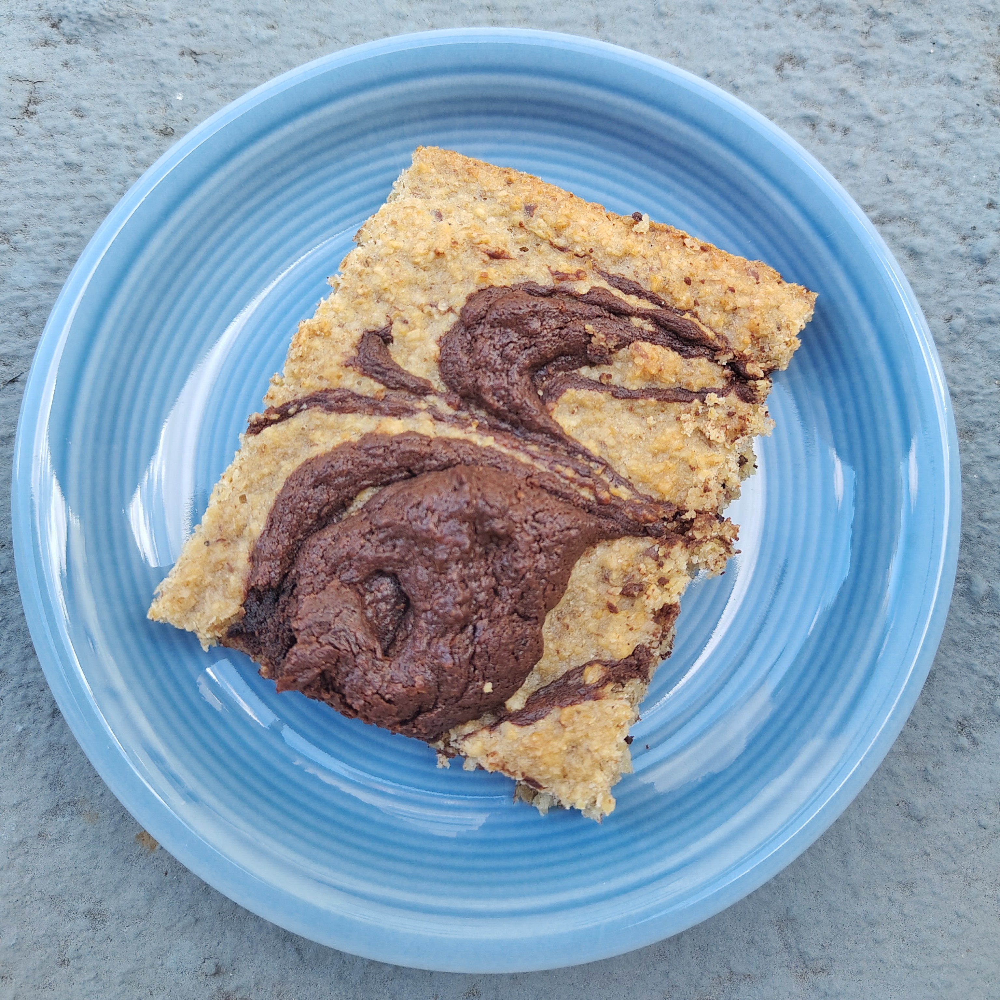

# Baked Oats mit Schoko-Tahin-Swirl

_vegan, vegetarisch, Kuchen, Januar, Februar, März, April, Mai, Juni, Juli, August, September, Oktober, November, Dezember_

**9 Stücke, 475 cm²**

---

## Topping

- _70 g_ Tahin
- _25 g_ Ahornsirup
- _5 Tropfen_ Vanilleextrakt
- _1 EL_ Kakaopulver
- _30 g_ Hafermilch

## Teig

- _200 g_ Haferflocken, gemahlen
- _5 g_ Leinsamen, gemahlen
- _60 g_ Zucker
- _1 Prise_ Zimt
- _1/2 TL_ Salz
- _160 g_ Hafermilch
- _20 g_ Öl
- _75 g_ Apfelmus
- _5 Tropfen_ Vanilleextrakt

---

Für das Topping alle Zutaten in einer kleinen Schüssel gut verrühren.

Eine Backform einfetten. Den Ofen auf 160˚C Umluft vorheizen.

Für den Teig alle trockenen Zutaten gut vermischen.

Ab jetzt zügig arbeiten, damit die Haferflocken nicht zu sehr quellen und der Teig flüssig genug bleibt, um ihn gut verarbeiten zu können: Die flüssigen Zutaten zugeben, gut verrühren, und den Teig in die vorbereitete Form geben. Teig glatt streichen. Mit einem Esslöffel das Topping darauf klecksen. Mit einem Buttermesser oder einer Gabel vorsichtig durch den Teig fahren, um ein marmoriertes Muster zu erzeugen.

Die Oats im Backofen 30 bis 35 Minuten backen, bis die Oberfläche trocken und leicht gebräunt ist. Abkühlen lassen und servieren.
