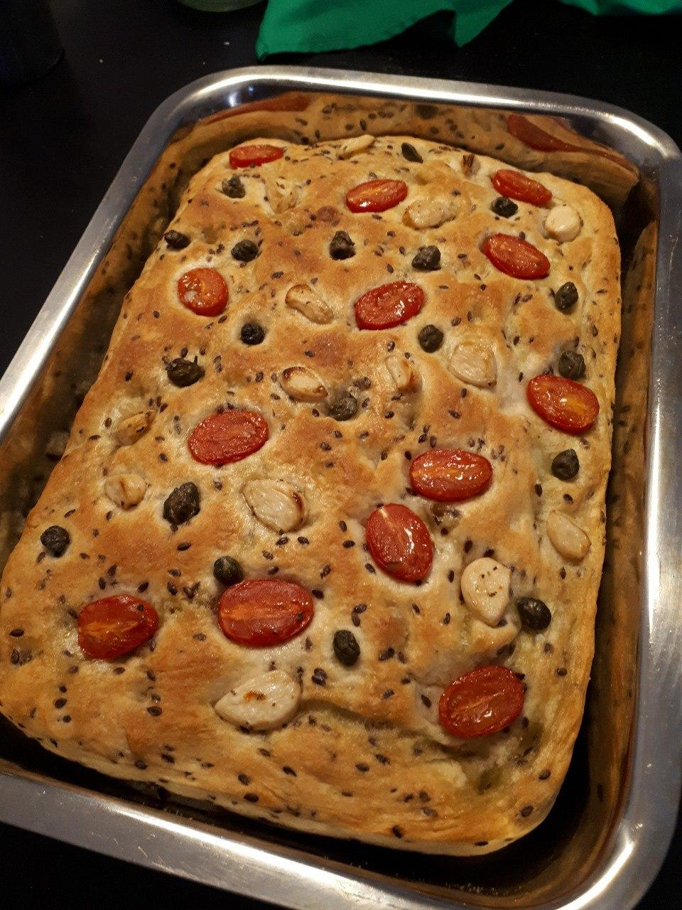

# Focaccia

*Brot, vegan, vegetarisch, Januar, Februar, März, April, Mai, Juni, Juli, August, September, Oktober, November, Dezember*

**1 Blech (25 cm * 35 cm)**

---

- *800 g* [Focacciateig](focacciateig.md)

## Toppings

- *100 g* Cocktailtomaten
- *20 g* Knoblauch, eingelegt
- *1 EL* Kapern
- Meersalzflocken
- Olivenöl

---

Das Backblech bzw. die Auflaufform mit Olivenöl einreiben und den Boden mit Meersalzflocken bestreuen. Den Teig in die Form stürzen und mit den Fingern vorsichtig in die Ecken ziehen. Mit einem feuchten Handtuch abdecken und eine weitere halbe Stunde gehen lassen.

In der Zwischenzeit die Cocktailtomaten der Länge nach halbieren. Den Knoblauch nach Belieben kleinschneiden.

Den Teig mit Olivenöl beträufeln. Mit den Fingerspitzen kleine Dellen in den Teig drücken. Die Tomatenhälften mit der Schnittfläche nach oben, den Knoblauch und die Kapern gleichmäßig auf dem Teig verteilen. Mit Meersalzflocken bestreuen. Erneut mit Olivenöl beträufeln.

Im vorgeheizten Backofen bei 230 °C Ober-/Unterhitze 20 - 25 Minuten goldbraun backen, dabei die Form nach der Hälfte der Zeit umdrehen, damit die Focaccia gleichmäßig bräunt. 

Mit mehr Olivenöl servieren.
