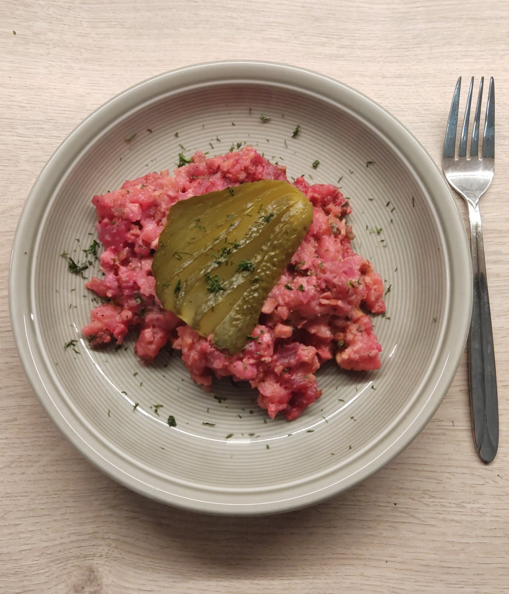

# veganes Labskaus

_vegan, vegetarisch, skalierbar, Januar, Februar, März, April, Mai, Juni, Juli, August, September, Oktober, November, Dezember_

**4 Portionen**

---

- _100 g_ Zwiebel
- _400 g_ Räuchertofu
- _1 kg_ Kartoffeln, vorwiegend festkochend
- _3 EL_ Rapsöl
- _250 ml_ Wasser
- Salz
- _1 TL_ Gemüsebrühe
- _1_ Lorbeerblatt
- _6_ Gewürzgurken
- _200 g_ Rote Bete, sauer eingelegt
- Zucker
- Essig
- Senf
- Pfeffer

---

Zwiebel schälen und würfeln. Vom Tofu pro Portion zwei Streifen für die Garnitur abschneiden, Rest hacken. Kartoffeln schälen, waschen und würfeln.

Öl in Topf erhitzen, Tofustreifen darin braun anbraten. Tofu herausnehmen und zur Seite stellen.

Zwiebeln und Tofuwürfel im Öl anbraten. Wasser, Kartoffeln, Salz, Gemüsebrühe und Lorbeerblatt zugeben, aufkochen, und ca. 15 Minuten kochen, bis die Kartoffeln gar sind.

Lorbeerblatt entfernen. Alles mit einem Kartoffelstampfer grob zerstampfen. Die Hälfte der Gurken und Rote Bete hacken und unterheben. Mit Zucker, Salz, Essig, Senf und Pfeffer abschmecken.

Mit gebratenen Tofustreifen und restlichen Gewürzgurkenstreifen garniert servieren.
