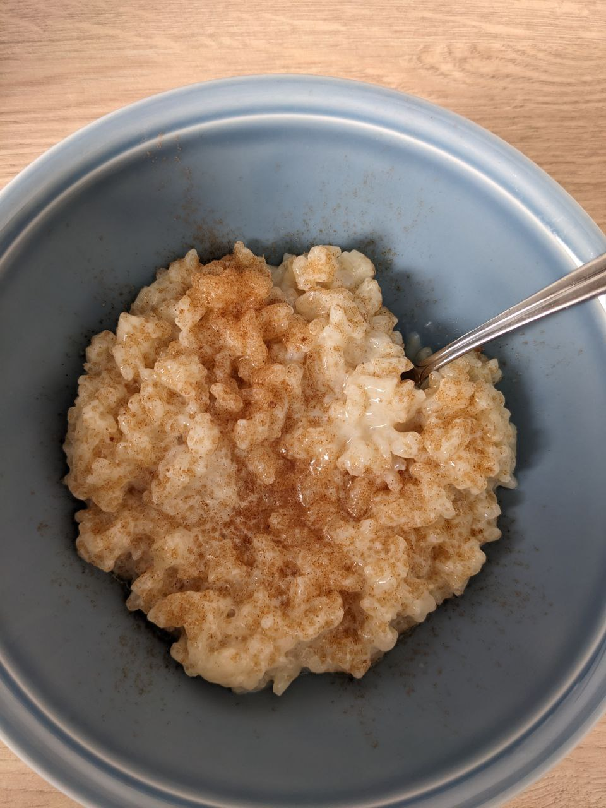

# Milchreis

_vegan, vegetarisch, Nachtisch, skalierbar, Januar, Februar, März, April, Mai, Juni, Juli, August, September, Oktober, November, Dezember_

**3 Portionen, 6 Portionen (Nachtisch)**

---

- _1 l_ Pflanzenmilch
- _1 Prise_ Salz
- Zucker
- _1 TL_ Vanilleextrakt (optional)
- Zitronenschale (optional)
- _1_ Zimtstange (optional)
- _230 g_ Milchreis (alternativ anderer Rundkornreis)
- Zimt und Zucker, zum Servieren

---

Milch mit Salz und gewünschten Gewürzen (Vanille, Zitrone, Zimt) zum Kochen bringen. Mit Zucker nach Wunsch süßen.

Reis hinzufügen und 20-30 Minuten kochen, bis der Reis gar ist. Mit Zimt und Zucker servieren.
