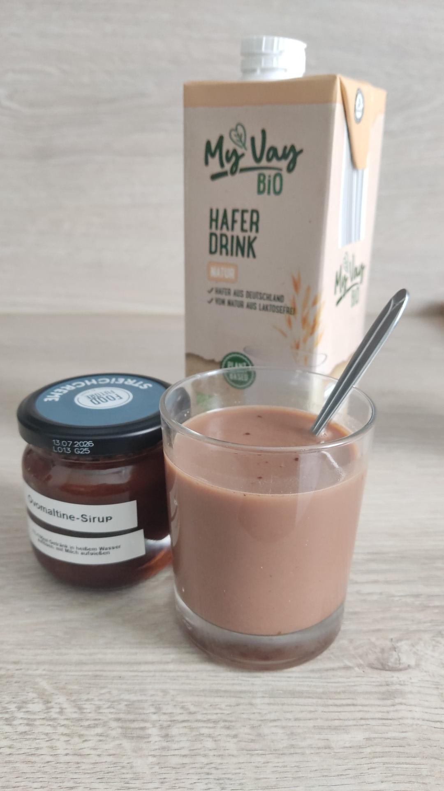

# Getränk nach Art einer Ovomaltine

_Cocktails, vegan, vegetarisch, Januar, Februar, März, April, Mai, Juni, Juli, August, September, Oktober, November, Dezember_

**100 ml Sirup, 2 l Getränk**

---

## Sirup

- _2 EL_ Kakaopulver
- _120 g_ Gerstenmalzsirup (Reformhaus)
- _1 TL_ Vanilleextrakt
- _1 Priese_ Salz

## fertiges Getränk

- heißes Wasser
- Milch nach Wahl
- Zucker (optional)

---

Für den Sirup alle Zutaten mit einer Gabel gut verrühren. Im Kühlschrank aufbewahren.

Für das Getränk pro 100 ml Milch 1 TL Sirup in einem Schluck heißen Wasser auflösen. Milch zugeben, kurz umrühren und servieren.
