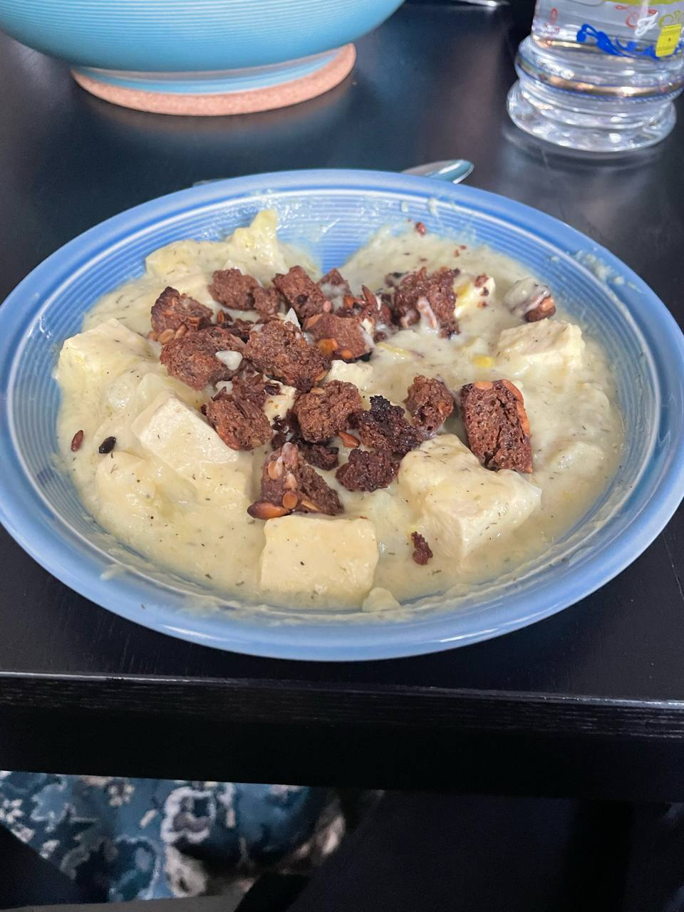

# Schwedische Fischsuppe

_vegan, vegetarisch, Eintopf, skalierbar, Januar, Februar, März, April, Mai, Juni, Juli, August, September, Oktober, November, Dezember_

**3 Portionen**

---

- _400 g_ Naturtofu
- _600 ml_ veganer Fischfond (zB https://www.meatlessheaven.de/collections/vegane-bruhen/products/vegane-fischbruehe-vish-style?variant=34815258067077)
- _150 cm²_ Kombu
- _1_ Zwiebel
- _600 g_ Kartoffeln
- _400 g_ Lauch
- _2 EL_ Öl
- _2 TL_ Gemüsebrühe-Pulver
- _1/2_ Bio-Zitrone, Schale davon
- _1 TL_ getrockneter Dill
- Salz
- Pfeffer
- Zitronensaft
- _150 g_ Creme Vega
- _2 EL_ Leinöl
- _6 Scheiben_ Brot (optional, Gerster oder Pumpernickel, nach Belieben getoastet)

---

Tofu in 1 cm große Würfel schneiden. Fischfond mit Kombu aufkochen und kräftig mit Salz abschmecken. Tofu zugeben und köcheln lassen.

Für die Suppe Zwiebel würfeln. Kartoffeln schälen und würfeln. Lauch putzen, in halbe Ringe schneiden, und waschen.

Öl in Topf erhitzen. Zwiebeln anschwitzen. Kartoffeln und Lauch zugeben, Hitze etwas erhöhen und anbraten.

Beim Tofu Hitze reduzieren. 2/3 der Brühe abnehmen und zur Suppe geben. Tofu in restlicher Brühe weiter ziehen lassen.

Gemüsebrühe, Zitronenschale, und Dill zur Suppe geben und köcheln lassen, bis die Kartoffeln weich sind.

Nach belieben einige Kellen Suppe zur Seite stellen, bevor die Suppe püriert wird. Creme Vega und Leinöl mit in den Topf geben und mit dem Pürierstab pürieren. Bei Bedarf die restliche Tofu-Brühe oder etwas Wasser zugeben.

Zur Seite gestellte Suppe und Tofu zur Suppe geben. Mit Salz, Pfeffer, Zitronensaft sowie evtl. mit Gemüse- oder Fischbrühenpulver abschmecken und nach Belieben mit Brot servieren.
