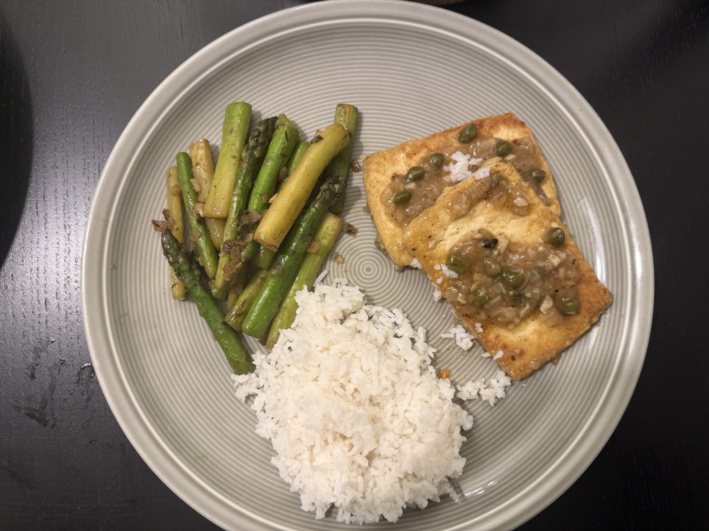

# Tofu Piccata

_vegan, vegetarisch, Januar, Februar, März, April, Mai, Juni, Juli, August, September, Oktober, November, Dezember_

**2 Portionen**

---

## Tofu

- _400 g_ Naturtofu
- _4 EL_ Mehl
- _1 EL_ Hefeflocken
- _0.5 TL_ Salz
- _0.5 TL_ Pfeffer
- _0.25 TL_ Knoblauchpulver
- _2 EL_ vegane Butter

## Sauce

- _2 EL_ vegane Butter
- _60 g_ Zwiebel
- _4 Zehen_ Knoblauch
- _175 ml_ Gemüsebrühe
- _2 EL_ Zitronensaft
- _1.5 EL_ Kapern
- _1/8_ Salzzitrone (oder frische Zitronenschale)
- Salz
- Pfeffer
- _1 EL_ Stärke zum Binden (optional)
- _2 EL_ Petersilie (optional, zum Garnieren)
- _1_ Bio-Zitrone (optional, zum Garnieren)

---

Jeden Block Tofu in drei große Scheiben schneiden und auspressen.

Zwiebeln fein würfeln. Knoblauch hacken. Zitronenschale abreiben oder Salzzitrone hacken.

Weiter für den Tofu Mehl, Hefeflocken, Salz, Pfeffer, und Knoblauchpulver mischen. Tofu in dieser Mischung wenden.

Butter in Pfanne erhitzen. Tofu darin goldbraun braten. Aus der Pfanne nehmen und zur Seite stellen.

Nun die Sauce zubereiten. Dafür Butter in die Pfanne geben. Zwiebeln und Knoblauch darin anschwitzen. Mit Brühe ablöschen und aufkochen.

Wenn es köchelt, Zitronensaft, Salzzitrone und Kapern zugeben und etwas einkochen. Mit Salz und Pfeffer abschmecken und optional mit Stärke andicken.

Tofu zur Sauce in die Pfanne geben und 1-2 Minuten erhitzen. Optional mit Petersilie und/oder Zitronenscheiben garniert servieren.

Dazu passt Reis und grünen Bohnen oder grüner Spargel.
